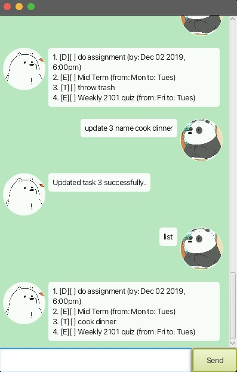

# Mochi User Guide



I am Mochi, your assistance for recording daily tasks.

## Hi

Say hi to Mochi and he will reply back

Example: `hi`

Mochi will say "Hellooo" back

```
Hellooo
```

## Adding deadlines

Add a new deadline task to be completed by

Usage: `deadline <description> /by <YYYY-MM-DD HHmm>`

Examples:
```
deadline
```

## Adding event

// Describe the action and its outcome.

// Give examples of usage

Example: `event (optional arguments)`

// A description of the expected outcome goes here

```
expected output
```

## Adding todo

// Describe the action and its outcome.

// Give examples of usage

Example: `todo (optional arguments)`

// A description of the expected outcome goes here

```
expected output
```

## Mark task

// Describe the action and its outcome.

// Give examples of usage

Example: `mark (optional arguments)`

// A description of the expected outcome goes here

```
expected output
```

## Unmark task

// Describe the action and its outcome.

// Give examples of usage

Example: `unmark (optional arguments)`

// A description of the expected outcome goes here

```
expected output
```

## Find task

// Describe the action and its outcome.

// Give examples of usage

Example: `find (optional arguments)`

// A description of the expected outcome goes here

```
expected output
```

## Delete task

// Describe the action and its outcome.

// Give examples of usage

Example: `delete (optional arguments)`

// A description of the expected outcome goes here

```
expected output
```

## Update task

// Describe the action and its outcome.

// Give examples of usage

Example: `update (optional arguments)`

// A description of the expected outcome goes here

```
expected output
```

## List

// Describe the action and its outcome.

// Give examples of usage

Example: `list`

// A description of the expected outcome goes here

```
expected output
```