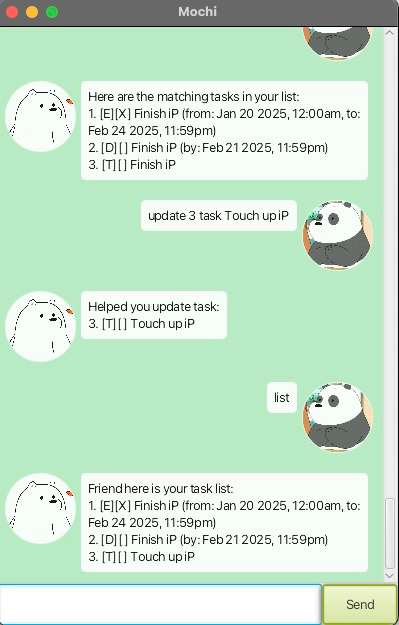

# Mochi User Guide



I am Mochi, your assistant for recording daily tasks.

## Hi

Say hi to Mochi and he will reply back

Usage: `hi`

Example:
```
hi
```

Expected Output:
```
Helloo my name is Mochi"
```

## Adding deadlines

Add a new deadline task to be completed by a specific date and time.

Usage: `deadline <task> /by <dd-mm-yyyy HHmm>`

Example:
```
deadline Finish iP /by 21-02-2025 2359
```

Expected Output:
```
Oooo Task added:
[D][ ] Finish iP (by: Feb 21 2025 11:59pm)
Friend you have X tasks in the list.
```

## Adding event

Add a new event task with a start and end time.

Usage: `event <task> /from <start> /to <end>`

Example:
```
event Finish iP /from 20-01-2025 0000 /to 21-02-2025 2359 
```

Expected Output:
```
Oooo Task added:
[E][ ] Finish iP (from: Jan 20 2025, 12:00am, to: Feb 21 2025, 11:59pm)
Friend you have X tasks in the list.
```

## Adding todo

// Describe the action and its outcome.

Usage: `todo Finish Ip`

Example:
```
todo Finish iP
```

Expected Output:
```
Oooo Task added:
[T][ ] Finish iP
Friend you have X tasks in the list.
```

## Mark task

Mark a task as completed.

Usage: `mark <task_index>`

Example:
```
mark 1
```

Expected Output:
```
Friend! I have marked this as done:
[T][X] Buy groceries
```

## Unmark task

Mark a task as not completed.

Usage: `unmark <task_index>`

Example:
```
unmark 1
```

Expected Output:
```
Friend! I have unmarked this as not done:
[T][] Buy groceries
```

## Find task

Find tasks that match a keyword.

Usage: `Find <keyword>`

Example:
```
find groceries
```

Expected Output:
```
Here are the matching tasks in your list:
1. [T][ ] Buy groceries
```

## Delete task

Find tasks that match a keyword.

Usage: `delete <task_index>`

Example:
```
delete 1
```

Expected Output:
```
Task removed:
1. [T][ ] Buy groceries
Friend you have X tasks in the list.
```

Expected Output:
```
Here are the matching tasks in your list:
1. [T][ ] Buy groceries
```

## Update task

Modify an existing task.

Usage: `update <task_index> <field> <new_value>`

Example:
```
update 1 task Buy vegetables
```

Expected Output:
```
Helped you update task:
1. [T][ ] Buy vegetables
```

## List

View all tasks in the list.

// Give examples of usage

Usage: `list`

Example:
```
list
```

Expected Output:
```
Friend here is your task list:
1. [T][ ] Buy vegetables
2. [D][ ] Finish iP (by: 25-12-2025 23:59)
```